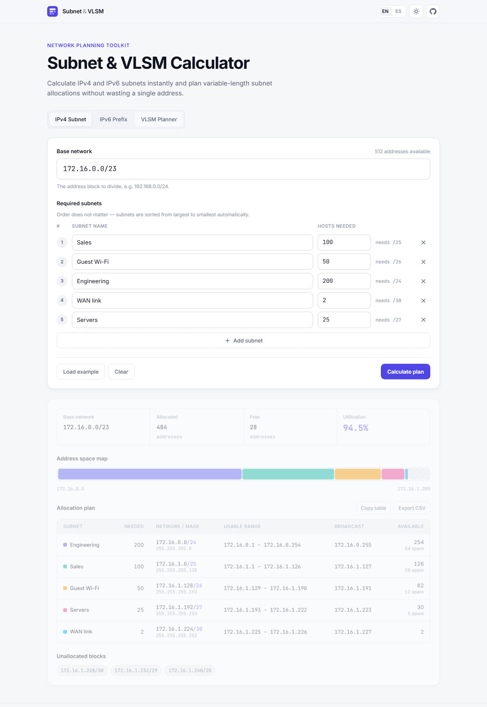
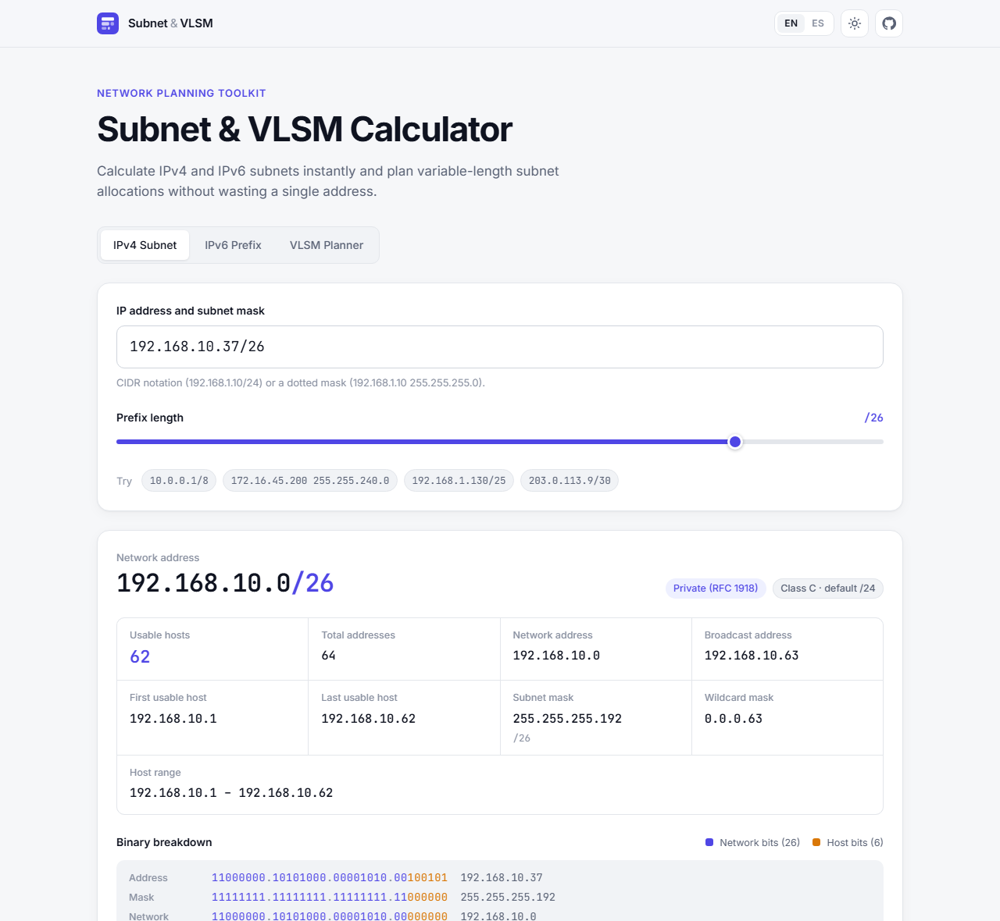
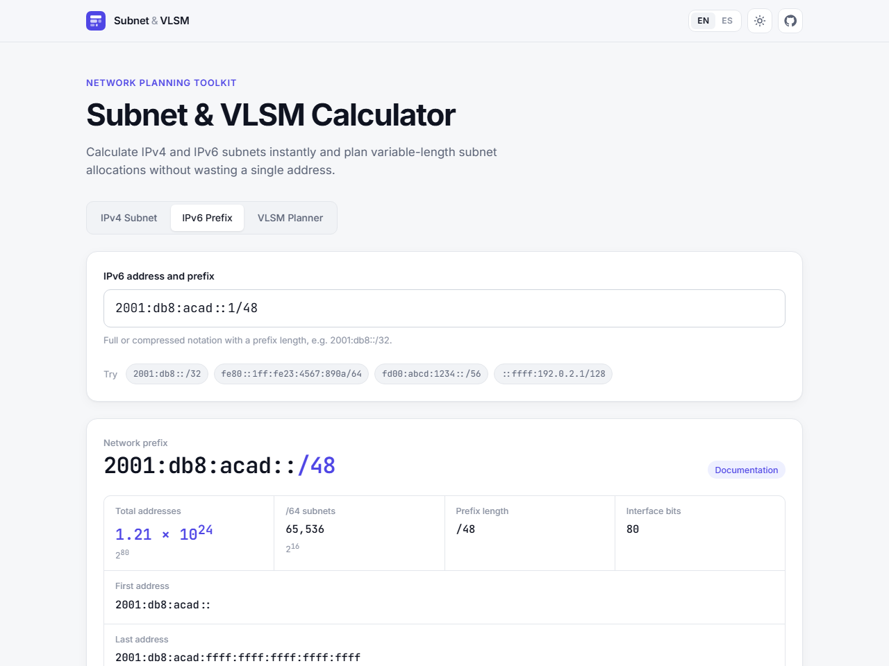
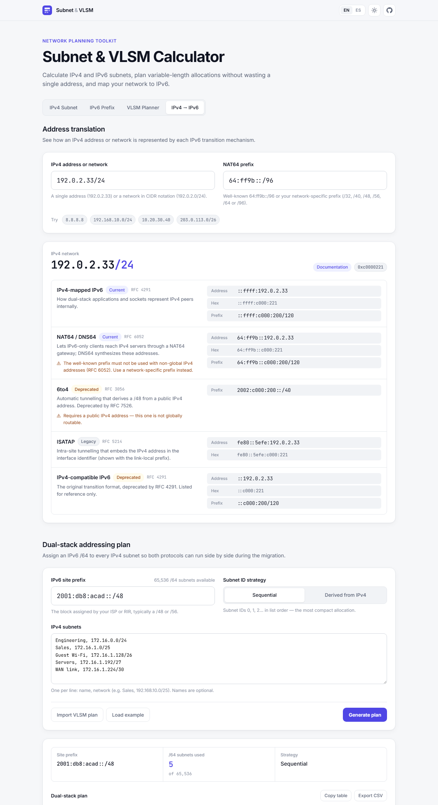
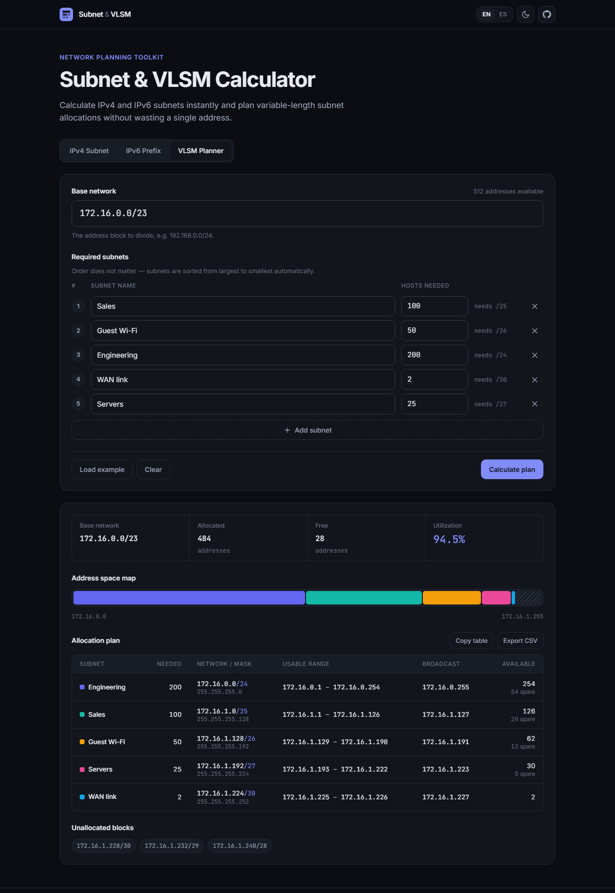

# Subnet & VLSM Calculator

[](https://github.com/BrandonIsMao/subnet-vlsm-calculator/actions/workflows/ci.yml)
[](LICENSE)

[](https://subnet-vlsm-calculator.vercel.app/)

A fast, modern subnet calculator and **VLSM (Variable Length Subnet Masking) planner** for network engineers, students and anyone designing IP address plans. It computes IPv4 and IPv6 subnet details instantly, builds optimal subnet allocations from a list of host requirements, and helps **migrate IPv4 networks to IPv6**.

**🔗 Live demo: [subnet-vlsm-calculator.vercel.app](https://subnet-vlsm-calculator.vercel.app/)**



## Features

### IPv4 subnet calculator
- Accepts CIDR (`192.168.1.10/24`), dotted masks (`192.168.1.10/255.255.255.0`) or space-separated input.
- Network, broadcast, first/last usable host, usable and total host counts.
- Subnet mask, wildcard mask, classful class (A–E) and address scope (private, loopback, CGNAT, documentation…).
- Interactive prefix slider and a colour-coded **binary breakdown** of network vs. host bits.
- Correct edge cases: `/31` point-to-point links (RFC 3021), `/32` host routes and `/0`.

### IPv6 prefix calculator
- Parses full, compressed (`::`) and IPv4-embedded (`::ffff:192.0.2.1`) notation.
- Canonical RFC 5952 output plus the fully expanded form.
- First/last address of the prefix, address count in scientific notation (e.g. `7.92 × 10²⁸`) with the exact value, and the number of `/64` subnets.
- Scope detection: global unicast, ULA, link-local, multicast, documentation, NAT64…

### VLSM planner
- Enter a base network and any number of named subnets with their required hosts.
- Subnets are **sorted largest-first automatically** and allocated without gaps.
- Results table with network/CIDR, mask, usable range, broadcast and available hosts (plus spare capacity).
- Visual **address-space map**, utilization summary and the remaining free space expressed as CIDR blocks.
- Clear validation errors that point at the offending field (e.g. _"Not enough space: the subnets need 484 addresses but 172.16.0.0/24 only has 256"_).
- Export to CSV or copy as a tab-separated table (pastes straight into Excel / Google Sheets).
- One click sends the plan to the IPv6 migration tool to build its dual-stack equivalent.

### IPv4 → IPv6 migration
- **Address translation:** shows every IPv6 representation of an IPv4 address or network, with its RFC, status (current / deprecated / legacy) and caveats:
  - IPv4-mapped IPv6 (`::ffff:192.0.2.33`) — RFC 4291
  - NAT64 / DNS64 with the well-known `64:ff9b::/96` or any network-specific prefix (`/32`, `/40`, `/48`, `/56`, `/64`, `/96`) — RFC 6052
  - 6to4 prefix (`2002:c000:221::/48`) — RFC 3056
  - ISATAP interface identifier (`fe80::5efe:192.0.2.33`) — RFC 5214
  - IPv4-compatible IPv6 (`::192.0.2.33`) — deprecated, for reference
- Warns when a mechanism can't be used with the given address (e.g. 6to4 with a private IPv4, or the NAT64 well-known prefix with non-global addresses).
- **Dual-stack plan:** assigns a `/64` from your IPv6 site prefix (e.g. a `/48`) to every IPv4 subnet, with suggested IPv4 and IPv6 gateways. Subnet IDs can be sequential or derived from the IPv4 network (`172.16.1.128/26` → `2001:db8:acad:180::/64`), with collision detection.
- Import subnets directly from the VLSM planner; export the plan to CSV.

### General
- 🌐 English / Spanish interface (auto-detected, switchable).
- 🌓 Light and dark themes (follows the system, remembers your choice).
- 📱 Fully responsive — the allocation table turns into cards on mobile.
- ♿ Accessible: keyboard-navigable tabs (WAI-ARIA), labelled inputs, live regions for results and errors.
- ⚡ No framework, no build step, **zero runtime dependencies**.

| IPv4 calculator | IPv6 calculator | IPv4 → IPv6 migration | Dark theme |
| --- | --- | --- | --- |
|  |  |  |  |

## Getting started

Requirements: [Node.js](https://nodejs.org/) 20 or newer (only used for the dev server and tests — the app itself is plain static files).

```bash
git clone https://github.com/BrandonIsMao/subnet-vlsm-calculator.git
cd subnet-vlsm-calculator
npm run dev      # http://localhost:5173
```

There is nothing to install. Any static file server works too (e.g. `python -m http.server`); the app only needs to be served over HTTP because it uses native ES modules.

### Running the tests

```bash
npm test
```

The calculation engine is covered by unit tests written with the built-in `node:test` runner (no test framework needed). They run automatically on every push via GitHub Actions.

## How the VLSM algorithm works

VLSM divides one address block into subnets of **different** sizes, so each segment gets only the addresses it needs. The planner (`src/core/vlsm.js`) works in three steps:

**1. Size each subnet.** A subnet with _h_ host bits has 2^_h_ addresses, two of which are reserved (network and broadcast). For every requirement we find the smallest _h_ such that `2^h − 2 ≥ hosts`, which gives the prefix `/(32 − h)`:

| Hosts needed | Block size | Prefix | Usable hosts |
| ---: | ---: | :---: | ---: |
| 2 | 4 | /30 | 2 |
| 25 | 32 | /27 | 30 |
| 50 | 64 | /26 | 62 |
| 100 | 128 | /25 | 126 |
| 200 | 256 | /24 | 254 |

**2. Sort largest first.** Requirements are ordered by block size, descending (ties keep the order in which they were entered).

**3. Allocate contiguously.** Starting at the base network address, each subnet is placed immediately after the previous one:

```
172.16.0.0/23 (512 addresses)
├── Engineering  172.16.0.0/24     256
├── Sales        172.16.1.0/25     128
├── Guest Wi-Fi  172.16.1.128/26    64
├── Servers      172.16.1.192/27    32
├── WAN link     172.16.1.224/30     4
└── free         172.16.1.228/30, 172.16.1.232/29, 172.16.1.240/28
```

**Why largest-first matters.** A subnet must start at an address that is a multiple of its block size. Every block size is a power of two, and when blocks are placed in descending order the running offset is always a sum of blocks that are _at least as large_ as the next one — so it is always a multiple of the next block size. Every subnet therefore lands on a valid boundary with **no alignment gaps**. Placing small subnets first would fragment the space (a `/30` at `.0` forces the next `/25` to start at `.128`, wasting 124 addresses).

As a consequence the plan is optimal: the only unavoidable waste is rounding each requirement up to a power of two, and a set of requirements fits **if and only if** the sum of their block sizes is no larger than the base network. That makes validation simple and exact — when the requirements don't fit, the planner reports how many addresses are needed vs. available and which subnets could not be placed.

Finally, the leftover range is decomposed into the minimum number of CIDR blocks (`rangeToCidrBlocks`), so the free space is ready to use for future growth.

## How IPv4 → IPv6 migration works

The migration module (`src/core/migration.js`) covers the two questions that come up when moving a network to IPv6.

**"What does this IPv4 address look like in IPv6?"** Most transition mechanisms embed the 32 IPv4 bits at a fixed position of the 128-bit address. IPv4-mapped (`::ffff:0:0/96`) and IPv4-compatible (`::/96`) place them in the last 32 bits; 6to4 places them right after `2002::/16`, producing a `/48` per public IPv4 address; ISATAP places them in the interface identifier after `5efe`.

NAT64 is the interesting case. RFC 6052 lets operators use their own prefix of 32–96 bits, and **bits 64–71 (the "u" octet) must always stay zero**, so the IPv4 address is split around them. For `192.0.2.33` (`c0.00.02.21`):

```
Prefix /32  2001:db8:[c000:0221]:[00]..              → 2001:db8:c000:221::
Prefix /40  2001:db8:01[c0:0002]:[00][21]..          → 2001:db8:1c0:2:21::
Prefix /48  2001:db8:0122:[c000]:[00][02:21]..       → 2001:db8:122:c000:2:2100::
Prefix /64  2001:db8:0122:0344:[00][c0:0002:21]..    → 2001:db8:122:344:c0:2:2100:0
Prefix /96  2001:db8:0122:0344::[c000:0221]          → 2001:db8:122:344::192.0.2.33
```

The implementation writes the IPv4 bits one by one starting at the prefix length and jumps from bit 64 to bit 72. The same walk gives the prefix length of an embedded **network**: a `/24` under a `/56` prefix becomes a `/88`, because 8 bits come before the u-octet and 16 after it. The official RFC 6052 examples are part of the test suite.

**"How do I address my existing subnets in IPv6?"** The recommended migration path is dual-stack: every IPv4 subnet keeps its addressing and also gets an IPv6 `/64` (the standard size for a LAN segment). With a site prefix of length _p_ there are 2^(64 − _p_) subnet IDs; a `/48` gives 65,536. The planner supports two strategies:

| Strategy | Subnet ID | Example (`2001:db8:acad::/48`) | Trade-off |
| --- | --- | --- | --- |
| Sequential | 0, 1, 2… in list order | `172.16.1.128/26` → `2001:db8:acad:2::/64` | Densest packing, never collides |
| Derived from IPv4 | Low bits of the IPv4 network address | `172.16.1.128/26` → `2001:db8:acad:180::/64` | Easy to correlate both plans; collisions are detected and reported |

## Project structure

```
├── index.html               # App shell and static markup
├── assets/                  # Favicon
├── src/
│   ├── core/                # Pure, framework-free calculation engine (fully unit tested)
│   │   ├── errors.js        # ValidationError with i18n-friendly codes
│   │   ├── ipv4.js          # Parsing, masks, subnet math, classification
│   │   ├── ipv6.js          # BigInt-based IPv6 parsing, RFC 5952 formatting
│   │   ├── migration.js     # IPv4 → IPv6 translation (RFC 6052…) and dual-stack planning
│   │   └── vlsm.js          # VLSM planner
│   ├── i18n/                # Tiny translation layer + en/es dictionaries
│   ├── ui/                  # DOM rendering for each panel, tabs, theme, helpers
│   ├── styles/main.css      # Design tokens, components, responsive rules
│   └── main.js              # Entry point
├── tests/                   # node:test unit tests for the core modules
├── scripts/serve.js         # Zero-dependency dev server
└── docs/screenshots/
```

**Design decisions**

- **Core / UI separation.** `src/core` has no DOM or language dependencies. Errors carry a code and parameters (e.g. `ipv4.octetOutOfRange`, `{ octet: "300" }`) that the UI translates, so the engine is reusable in a CLI, an API or another framework.
- **Correct integer math.** IPv4 addresses are unsigned 32-bit integers (normalised with `>>> 0` because JavaScript bitwise operators are signed); IPv6 uses `BigInt` because 128-bit values exceed `Number` precision.
- **Security.** All user-provided text (e.g. subnet names) is HTML-escaped before rendering.

## Tech stack

- **HTML5, CSS3** (custom properties, grid, `color-mix`) and **vanilla JavaScript** (ES modules, `BigInt`)
- **Node.js `node:test`** for unit testing
- **GitHub Actions** for continuous integration
- **Vercel** for hosting (static deployment, no build step)
- Fonts: [Inter](https://rsms.me/inter/) and [JetBrains Mono](https://www.jetbrains.com/lp/mono/)

## Deployment

The site is static, so it deploys to any static host without a build step.

The production site is hosted on Vercel at **https://subnet-vlsm-calculator.vercel.app/**.

**Vercel (recommended):** import the repository at [vercel.com/new](https://vercel.com/new), choose the **Other** framework preset, leave the build command empty and the output directory as the project root, then deploy. `vercel.json` adds security and caching headers. Every push to `main` redeploys automatically and every pull request gets a preview URL.

## Regenerating the screenshots

With the dev server running, capture any view with headless Chrome (append `#ipv4`, `#ipv6` or `#vlsm` to open a specific tab):

```bash
chrome --headless=new --hide-scrollbars --window-size=1280,1860 --virtual-time-budget=4000 \
  --screenshot=docs/screenshots/vlsm.png "http://localhost:5173/#vlsm"
```

Add `--blink-settings=preferredColorScheme=0` for the dark theme. To record an animated GIF, use a screen recorder such as [ScreenToGif](https://www.screentogif.com/) (Windows) or [Kap](https://getkap.co/) (macOS).

## License

[MIT](LICENSE) © 2026 Brandon Jimenez
